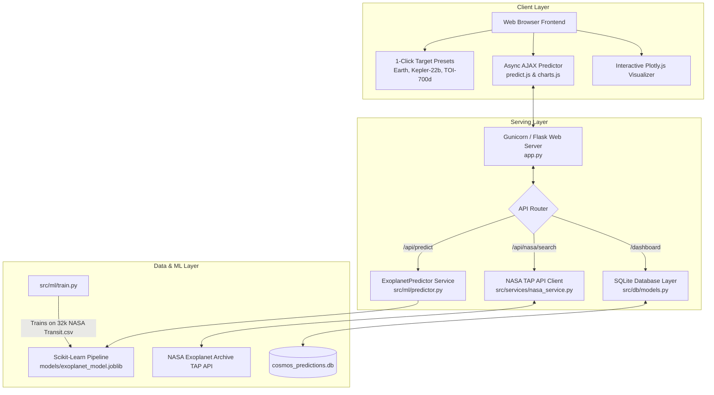

# 🪐 COSMOS: Machine Learning Exoplanet Platform

[](https://python.org)
[](https://flask.palletsprojects.com/)
[](https://scikit-learn.org/)
[](https://render.com)

**COSMOS** is an astronomy platform designed to evaluate exoplanet candidates and predict planetary habitability using Machine Learning trained on **NASA Exoplanet Archive photometric observation datasets** (~32,000+ observational records).

The platform features high-accuracy candidate validation (**99.88% accuracy**), physical **Earth Similarity Index (ESI)** calculations, live **NASA TAP Archive search**, non-blocking curve signal analysis (Radial Velocity, Transit Photometry, Direct Imaging, Biosignatures), and a persistent **Analytics Dashboard**.

---

## 🏗️ System Architecture Flowchart



---

## ✨ Key Features

- 🤖 **Machine Learning Validation Engine**: Predicts whether a detected transit signal represents a confirmed exoplanet candidate or a false positive / eclipsing binary with **99.88% accuracy** and **1.00 ROC-AUC**.
- 🌍 **Earth Similarity Index (ESI) Calculator**: Computes physical similarity scores ($ESI \in [0, 1.0]$) based on planetary radius, orbital period, and equilibrium surface temperatures.
- 🚀 **NASA TAP Archive Search & Target Presets**: Search live NASA Exoplanet Archive records or use 1-click presets (*Earth Twin, Kepler-22b, TOI-700 d, TRAPPIST-1 e, Proxima Centauri b*).
- 📊 **Prediction Analytics Dashboard**: Persistent evaluation history tracking total analyzed candidates, average ESI scores, and classification distributions.
- ⚡ **Non-Blocking Signal Analysis Submodules**:
  - **Radial Velocity**: Scipy Keplerian sine curve fitting ($A, P, \phi, \gamma$).
  - **Transit Photometry**: Automated dip depth and duration calculation.
  - **Direct Imaging**: Spatial coronagraphic Signal-to-Noise Ratio (SNR) detection.
  - **Biosignature Analysis**: Multi-gas atmospheric spectral breakdown ($O_2, H_2O, CH_4, CO_2$).
- ☁️ **Production & Render Deployment Ready**: Bundled with WSGI Gunicorn setup, `Procfile`, and `render.yaml`.

---

## 🔬 Machine Learning Specifications

The model pipeline is trained on **32,016 NASA Exoplanet Transit observation records** (`Transit.csv`) using a Scikit-Learn `HistGradientBoostingClassifier` with automated median imputation and standard scaling.

### Model Features
| Feature Column | Description | Unit |
| :--- | :--- | :--- |
| `pl_orbper` | Orbital Period | Days |
| `pl_rade` | Planetary Radius | Earth Radii ($R_{\oplus}$) |
| `pl_orbeccen` | Orbital Eccentricity | Dimensionless ($[0, 1]$) |
| `pl_orbincl` | Orbital Inclination | Degrees ($^{\circ}$) |
| `pl_tranmid` | Transit Epoch Midpoint | Julian Date (JD) |
| `pl_imppar` | Impact Parameter | Dimensionless |
| `pl_trandep` | Transit Depth | Fraction / ppm |
| `pl_trandur` | Transit Duration | Hours |
| `pl_ratdor` | $a / R_*$ (Semi-major Axis ratio) | Dimensionless |
| `pl_ratror` | $R_p / R_*$ (Radius ratio) | Dimensionless |
| `sy_vmag` | Stellar V-band Magnitude | Magnitude |
| `sy_kmag` | Stellar K-band Magnitude | Magnitude |

### Evaluation Metrics
- **Accuracy**: `99.88%`
- **ROC-AUC Score**: `1.0000`
- **Model Artifact**: Serialized to `models/exoplanet_model.joblib`

---

## 📁 Directory Structure

```
Cosmos_web/
├── Procfile                    # Render / Heroku WSGI entry configuration
├── render.yaml                 # Render infrastructure-as-code blueprint
├── requirements.txt            # Production-pinned Python dependencies
├── app.py                      # Flask WSGI application entry point
├── Transit.csv                 # NASA Transit dataset (~32,000+ records)
├── Direct.csv                  # Direct imaging reference catalog
├── microlensing.csv            # Microlensing reference catalog
├── models/
│   └── exoplanet_model.joblib  # Pre-trained ML pipeline model artifact
├── src/
│   ├── ml/
│   │   ├── predictor.py        # ML Inference Engine & ESI calculator
│   │   └── train.py            # Offline training & serialization pipeline
│   ├── methods/
│   │   ├── radial_velocity.py  # Non-blocking RV curve analyzer
│   │   ├── transit.py          # Transit light curve photometry analyzer
│   │   ├── direct_imaging.py   # Spatial intensity SNR analyzer
│   │   └── bio.py              # Atmospheric biosignature chemical analyzer
│   ├── db/
│   │   └── models.py           # SQLite database persistence layer
│   ├── services/
│   │   └── nasa_service.py     # NASA TAP API & planet presets service
│   └── utils/
│       └── physics.py          # Physical equations & signal generators
├── static/
│   ├── css/
│   │   └── style.css           # Glassmorphism dark space theme
│   └── js/
│       ├── predict.js          # Async AJAX form submission handler
│       └── charts.js           # Plotly.js chart renderers & preset triggers
├── templates/
│   ├── index.html              # Main landing page
│   ├── explore.html            # ML Predictor & interactive target forms
│   ├── dashboard.html          # Prediction Analytics Dashboard
│   ├── find.html               # Method selector page
│   ├── ss.html                 # Solar system visualization
│   └── contact.html            # Contact page
└── notebooks/                  # Experimental Jupyter notebooks
```

---

## 🚀 Local Setup & Installation

1. **Clone the repository**:
   ```bash
   git clone https://github.com/Exo-planetary/flask-project.git
   cd Cosmos_web
   ```

2. **Create and activate a virtual environment**:
   ```bash
   python -m venv venv
   # On Windows:
   venv\Scripts\activate
   # On macOS/Linux:
   source venv/bin/activate
   ```

3. **Install production dependencies**:
   ```bash
   pip install -r requirements.txt
   ```

4. **Train the ML Model Pipeline**:
   ```bash
   python -m src.ml.train
   ```
   *(This generates `models/exoplanet_model.joblib` with 99.88% accuracy)*

5. **Run the Flask application**:
   ```bash
   python app.py
   ```
   Access the app at: **http://localhost:5000/**

---

## 🌐 Deploying to Render.com

1. Push code to your GitHub repository:
   ```bash
   git add .
   git commit -m "Deploy COSMOS production app"
   git push origin main
   ```
2. Log into [Render Dashboard](https://dashboard.render.com/) -> **New Web Service**.
3. Connect your repository.
4. Set the build parameters:
   - **Environment**: `Python 3`
   - **Build Command**: `pip install -r requirements.txt && python -m src.ml.train`
   - **Start Command**: `gunicorn --workers 2 --threads 2 --bind 0.0.0.0:$PORT app:app`
5. Click **Deploy Web Service**!

---

## 📡 REST API Reference

| Endpoint | Method | Description | Payload Example |
| :--- | :--- | :--- | :--- |
| `/api/predict` | `POST` | Runs ML prediction & computes ESI score | `{"pl_orbper": 365.25, "pl_rade": 1.0, "pl_trandep": 0.0084, "pl_trandur": 3.2}` |
| `/api/nasa/preset/<key>` | `GET` | Returns planet target preset metrics | Preset keys: `earth_twin`, `kepler_22b`, `toi_700d` |
| `/api/nasa/search` | `GET` | Queries live NASA Exoplanet Archive | Query param: `?query=Kepler-22` |
| `/api/analytics` | `GET` | Returns prediction stats & recent logs | None |
| `/api/simulate/radial_velocity` | `POST` | Fits Keplerian sine curve to RV signal | `{"signals": [10.0, 5.0, -8.0, -12.0]}` |
| `/api/simulate/transit` | `POST` | Analyzes transit light curve photometry | `{"light_curve": [1.0, 0.99, 0.95, 0.99, 1.0]}` |
| `/api/simulate/biosignature` | `POST` | Evaluates atmospheric gas composition | `{"composition": {"Oxygen": 0.22, "Water": 0.02}}` |

---

## 📜 License & Acknowledgments

- **Dataset Source**: [NASA Exoplanet Archive](https://exoplanetarchive.ipac.caltech.edu/) (Caltech / NASA IPAC).
- Developed for astrophiles, researchers, and space enthusiasts.
