# 🌌 COSMOS Exoplanet Platform: Future Features & Enhancement Roadmap

This document outlines a structured, hierarchical roadmap for expanding **COSMOS** into a world-class, enterprise-grade astronomical research and public discovery platform.

---

## 🏛️ Hierarchical Feature Matrix Overview

```mermaid
graph TD
    Root[COSMOS Architectural Expansion] --> T1[Tier 1: Core Astrophysics Engine]
    Root --> T2[Tier 2: Deep Learning & Physics-Informed ML]
    Root --> T3[Tier 3: Real-Time NASA/MAST Data Ingestion]
    Root --> T4[Tier 4: Enterprise MLOps & User Workspaces]

    T1 --> T1_1[3D Keplerian Orbit Visualizer Three.js]
    T1 --> T1_2[JWST Transmission Spectroscopy Engine]
    T1 --> T1_3[Kasting-Kopparapu Habitable Zone Model]

    T2 --> T2_1[1D-CNN Light Curve Classifier]
    T2 --> T2_2[Deep Autoencoder Spectral Anomaly Detector]
    T2 --> T2_3[Physics-Informed Neural Nets PINNs]
    T2 --> T2_4[SHAP / LIME Explainable AI Visualizer]

    T3 --> T3_1[Live MAST FITS File Downloader lightkurve]
    T3 --> T3_2[NASA TESS/Kepler Target Alert Feed]
    T3 --> T3_3[Automated PDF Scientific Report Generator]

    T4 --> T4_1[PostgreSQL / Supabase User Authentication]
    T4 --> T4_2[Airflow Automated Retraining Pipeline]
    T4 --> T4_3[ONNX Runtime Low-Latency Microservice]
    T4 --> T4_4[Evidently AI Model Drift Monitoring]
```

---

## 🔬 Tier 1: Advanced Astrophysics Engine & Interactive Visuals

### 1.1 3D Interactive Keplerian Orbit Simulator (Three.js / WebGL)
- **Description**: Real-time 3D planetary orbit renderer powered by Three.js.
- **Capabilities**:
  - Render host star, planet size scale ratios, orbital inclination ($i$), eccentricity ($e$), and semi-major axis ($a$).
  - Toggle transit view mode showing exact alignment when inclination approaches $90^{\circ}$.
  - Real-time illumination shading and planet surface texture maps.

### 1.2 JWST Transmission Spectroscopy & Atmospheric Synthesizer
- **Description**: Simulates light passing through exoplanetary atmospheres during transit (transmission spectra).
- **Capabilities**:
  - Model chemical absorption bands for $H_2O, CO_2, CH_4, CO, NH_3,$ and $O_3$ at infrared wavelengths ($0.6\,\mu\text{m} - 12\,\mu\text{m}$).
  - Synthesize synthetic James Webb Space Telescope (JWST / NIRSpec) observation points with instrument noise models.

### 1.3 Kasting & Kopparapu Habitable Zone (HZ) Boundary Model
- **Description**: Implements peer-reviewed atmospheric radiative-convective climate models.
- **Capabilities**:
  - Calculates **Recent Venus**, **Runaway Greenhouse**, **Moist Greenhouse**, **Maximum Greenhouse**, and **Early Mars** boundary flux distances ($AU$).
  - Overlays target exoplanet position relative to its host star's effective temperature ($T_{\text{eff}}$) and luminosity ($L_*$).

---

## 🤖 Tier 2: Deep Learning & Physics-Informed ML

### 2.1 1D-CNN Light Curve Phase-Folded Signal Classifier
- **Description**: 1D Convolutional Neural Network trained directly on raw Kepler/TESS time-series photometric flux arrays.
- **Architecture**:
  - Dual-branch local & global view 1D-CNN (inspired by NASA's Anomaly Detection Model).
  - High-pass filtering and Savitzky-Golay / Gaussian Process stellar noise de-trenders.
  - Distinguishes subtle transits from background eclipsing binary stars and stellar flares.

### 2.2 Deep Autoencoder Spectral Anomaly Detector
- **Description**: Unsupervised Neural Network for detecting unexpected chemical compounds or non-terrestrial biosignature anomalies.
- **Capabilities**:
  - Flags planetary atmospheres with chemical disequilibrium (e.g., simultaneous high concentrations of $O_2$ and $CH_4$).

### 2.3 Physics-Informed Neural Networks (PINNs)
- **Description**: Integrates Kepler's Third Law ($P^2 = a^3 / M_*$) and conservation of angular momentum directly into loss functions.
- **Benefits**: Eliminates physically impossible predictions (e.g. negative planet mass or superluminal orbital speeds).

### 2.4 Explainable AI (XAI) SHAP Feature Attribution Panel
- **Description**: Provides visual explanation cards showing why the ML model confirmed or rejected a candidate.
- **Visuals**: SHAP waterfall plots highlighting top contributing features (e.g. $+35\%$ due to transit depth, $-10\%$ due to high eccentricity).

---

## 📡 Tier 3: Real-Time Astronomical Data Integration & Cloud Services

### 3.1 Live MAST (Mikulski Archive) FITS File Downloader
- **Description**: Real-time integration with Mikulski Archive for Space Telescopes via `lightkurve`.
- **Capabilities**:
  - Users enter Kepler ID (e.g. `KIC 10593626`) or TESS TOI (e.g. `TOI-700`).
  - Downloads official FITS data, de-trends stellar noise, phase-folds light curves, and passes data to ML inference in real-time.

### 3.2 Automated PDF Scientific Dossier Generator
- **Description**: Generates downloadable publication-ready PDF research reports for analyzed exoplanet candidates.
- **Content**: Includes planet parameters, ESI score, fitted light curves, habitability maps, and NASA Archive reference metadata.

### 3.3 Community Vetting & Crowdsourced Classification
- **Description**: Allows registered users to vote, comment, and attach research notes to candidate predictions (Zooniverse-style community vetting).

---

## ⚙️ Tier 4: Enterprise MLOps & Production Infrastructure

### 4.1 Automated Retraining & TAP Sync Pipeline (Apache Airflow / Prefect)
- **Description**: Weekly scheduled DAG that polls NASA Exoplanet Archive for new data releases.
- **Workflow**:
  1. Ingests newly confirmed planets.
  2. Runs automated model retraining and cross-validation checks.
  3. Deploys updated model artifacts if accuracy exceeds threshold ($>99.5\%$).

### 4.2 Low-Latency ONNX Runtime / Triton Inference Microservice
- **Description**: Converts trained scikit-learn / XGBoost / PyTorch models into **ONNX (Open Neural Network Exchange)** format.
- **Benefits**: Reduces inference latency to $< 5\,\text{ms}$ per request, handling high-concurrency global traffic.

### 4.3 Model Drift & Data Quality Monitoring (Evidently AI)
- **Description**: Real-time monitoring dashboard tracking shifts between training data distribution (Kepler) and live user query data (TESS / PLATO).
- **Alerts**: Triggers automated warnings if feature drift occurs.

---

## 🗓️ Phased Implementation Timeline

| Phase | Milestone | Duration | Key Deliverables |
| :--- | :--- | :--- | :--- |
| **Phase 1** | **3D Visuals & HZ Engine** | Weeks 1 – 3 | Three.js orbit viewer, Kasting-Kopparapu HZ calculator |
| **Phase 2** | **1D-CNN Light Curve Engine** | Weeks 4 – 6 | PyTorch 1D-CNN model, `lightkurve` MAST FITS integration |
| **Phase 3** | **PDF Dossiers & User Auth** | Weeks 7 – 9 | ReportLab PDF generator, Supabase / PostgreSQL auth |
| **Phase 4** | **Enterprise MLOps & ONNX** | Weeks 10 – 12 | ONNX Runtime engine, Airflow retraining DAG, Evidently AI drift dashboard |
